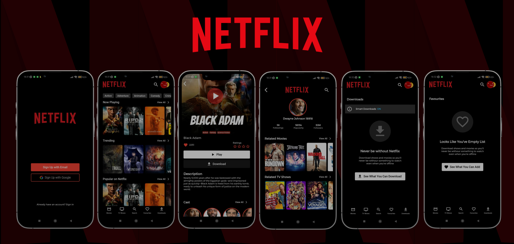

## Netflix Mobile

## Table of Contents

- [Introduction](#introduction)
- [Features](#features)
- [Build Process](#build-process)
- [Tech Stack](#tech-stack)

 

## Introduction
Netflix, Inc. is an American subscription video on-demand over-the-top streaming service and production company based in Los Gatos, California.

This is a netflix mobile app which was build using flutter technology.

## Features

🚀 Search/View Movies, TV Shows  
🚀 View Movies & TV Shows by category  
🚀 Similar Movies, TV Shows  
🚀 Actor/Actress Details & Related Movies, TV Shows

## Build Process

- Clone or download the repo
- `pub get` to install dependencies
- `flutter run` to run the application

## Tech Stack

    
    

## Project Goals & Outcomes

✔️ Learning Flutter  
✔️ Learning How to connect API to Flutter App